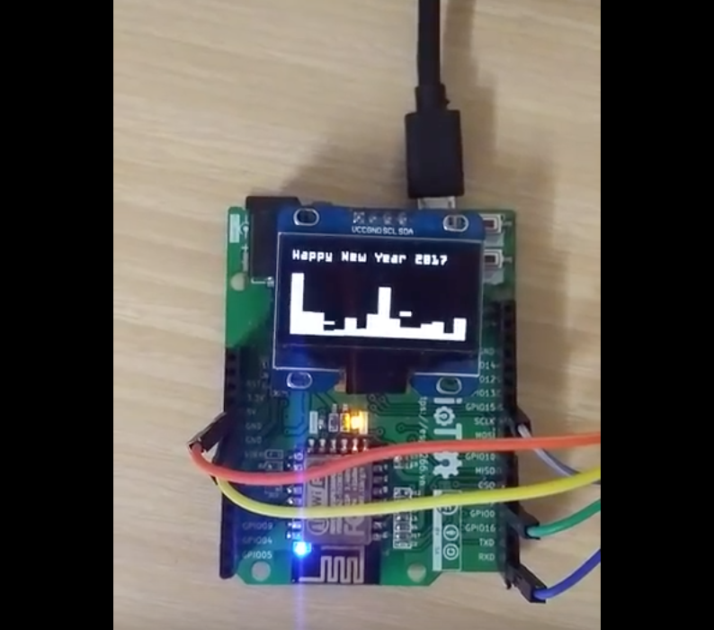

#ESP8266 Audio Player

Based on: 
- [esp-open-rtos](https://github.com/SuperHouse/esp-open-rtos)
- mad library from https://github.com/espressif/ESP8266_MP3_DECODER/
- http://kissfft.sourceforge.net/

## Install
- Put `happy-new-year.mp3` - Mono to folder `files` (limit file size is 2Mbytes)

```
export OPEN_RTOS_PATH=/path/to/esp-open-rtos
make && make flash
```

- I2S connection
```
ESP pin   - I2S signal
----------------------
GPIO2/TX1   - LRCK
GPIO3/RX0   - DATA
GPIO15      - BCLK
```

## Demo: 


https://youtu.be/8Z-Cp0hWlhs
